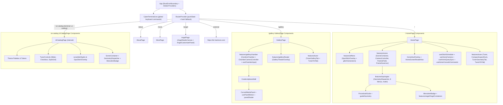

```mermaid
flowchart TD
    App["App (RootErrorBoundary + Global Providers)"] --> Terminal["CyberTerminalLine (global keyboard commands)"]
    App --> Router["RouterProvider (pushState + hash fallback)"]

    Router -->|"/"| Home["HomePage"]
    Router -->|"/gallery"| Gallery["GalleryPage"]
    Router -->|"/about"| About["AboutPage"]
    Router -->|"/more"| More["MorePage"]
    Router -->|"/angel"| Angel["AngelPage (AngelStudioCanvas + AngelCustomizerPanel)"]
    Router -->|"/ui-catalog (terminal: ui-catalog)"| UiCatalog["UiCatalogPage (internal)"]
    Router -->|"external"| DCHC["https://dc-hardcore.com"]

    subgraph HomeTree["/ HomePage Components"]
        Home --> Glitch["features/effects (GpuGlitchOverlay + glitchGenerators)"]
        Home --> Scene["features/scene (SceneContainer, CameraController, ParticleField, FrameGovernor)"]
        Scene --> Dispatcher["features/topologies (GeometryDispatcher, 8 Menus, math/)"]
        Dispatcher --> Guide["ProceduralGuide + guideGeometry"]
        Dispatcher --> Badge["MenuItemBadge + features/angel/AngelContainers"]
        Home --> HomeHUD["HomeHudOverlay + HomeScreenReaderNav"]
        Home --> HomeHooks["useGlitchScheduler + useHomeCamera + useHomeQuerySync + useHomeConsoleCommands"]
        Home --> TunerHome["features/tuner (Tuner, CompactInspectDock, TunerGeometryTab, TunerVfxTab)"]
    end

    subgraph GalleryTree["/gallery GalleryPage Components"]
        Gallery --> Chamber["features/gallery/chamber (CerebroChamber + ChamberCameraController + useChamberInput)"]
        Chamber --> SphereWall["CerebroSphereWall"]
        SphereWall --> MediaPanel["CurvedMediaPanel + usePanelMotion + panelShader"]
        Gallery --> Theater["features/gallery/theater (GalleryTheaterOverlay)"]
        Gallery --> TunerGallery["features/tuner (TunerGalleryTab + TunerVfxTab)"]
    end

    subgraph CatalogTree["/ui-catalog UiCatalogPage Components"]
        UiCatalog --> CatalogTokens["Theme Palettes & Tokens"]
        UiCatalog --> CatalogControls["TunerControls (Slider, Checkbox, StyleGrid)"]
        UiCatalog --> CatalogFx["scrambleGlyphs & GpuGlitchOverlay"]
        UiCatalog --> Catalog3D["SceneContainer + GeometryDispatcher + MenuItemBadge"]
    end
```
