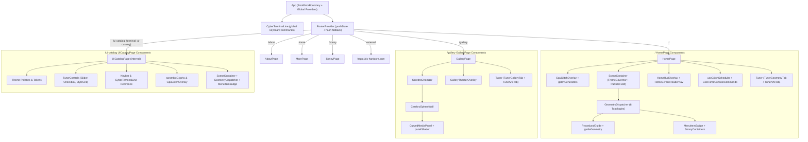

```mermaid
flowchart TD
    App["App (RootErrorBoundary + Global Providers)"] --> Terminal["CyberTerminalLine (global keyboard commands)"]
    App --> Router["RouterProvider (pushState + hash fallback)"]

    Router -->|"/"| Home["HomePage"]
    Router -->|"/gallery"| Gallery["GalleryPage"]
    Router -->|"/about"| About["AboutPage"]
    Router -->|"/more"| More["MorePage"]
    Router -->|"/sonny"| Sonny["SonnyPage"]
    Router -->|"/ui-catalog (terminal: ui-catalog)"| UiCatalog["UiCatalogPage (internal)"]
    Router -->|"external"| DCHC["https://dc-hardcore.com"]

    subgraph HomeTree["/ HomePage Components"]
        Home --> Glitch["GpuGlitchOverlay + glitchGenerators"]
        Home --> Scene["SceneContainer (FrameGovernor + ParticleField)"]
        Scene --> Dispatcher["GeometryDispatcher (8 Topologies)"]
        Dispatcher --> Guide["ProceduralGuide + guideGeometry"]
        Dispatcher --> Badge["MenuItemBadge + SonnyContainers"]
        Home --> HomeHUD["HomeHudOverlay + HomeScreenReaderNav"]
        Home --> HomeHooks["useGlitchScheduler + useHomeConsoleCommands"]
        Home --> TunerHome["Tuner (TunerGeometryTab + TunerVfxTab)"]
    end

    subgraph GalleryTree["/gallery GalleryPage Components"]
        Gallery --> Chamber["CerebroChamber"]
        Chamber --> SphereWall["CerebroSphereWall"]
        SphereWall --> MediaPanel["CurvedMediaPanel + panelShader"]
        Gallery --> Theater["GalleryTheaterOverlay"]
        Gallery --> TunerGallery["Tuner (TunerGalleryTab + TunerVfxTab)"]
    end

    subgraph CatalogTree["/ui-catalog UiCatalogPage Components"]
        UiCatalog --> CatalogTokens["Theme Palettes & Tokens"]
        UiCatalog --> CatalogControls["TunerControls (Slider, Checkbox, StyleGrid)"]
        UiCatalog --> CatalogNav["Navbar & CyberTerminalLine Reference"]
        UiCatalog --> CatalogFx["scrambleGlyphs & GpuGlitchOverlay"]
        UiCatalog --> Catalog3D["SceneContainer + GeometryDispatcher + MenuItemBadge"]
    end
```
